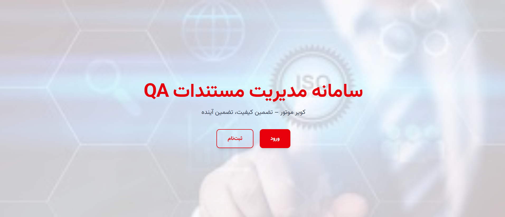
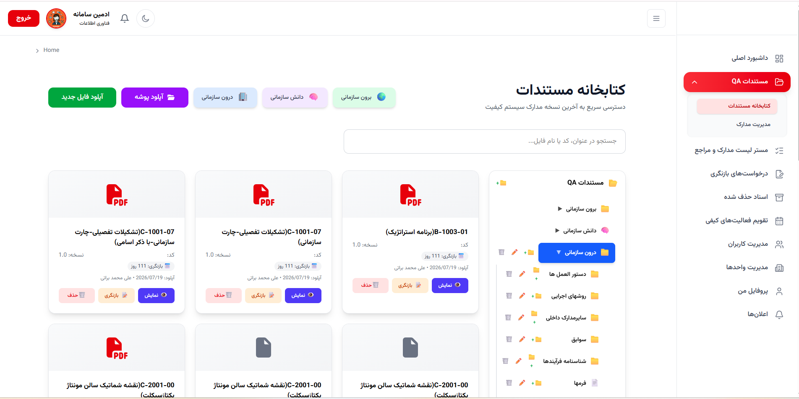
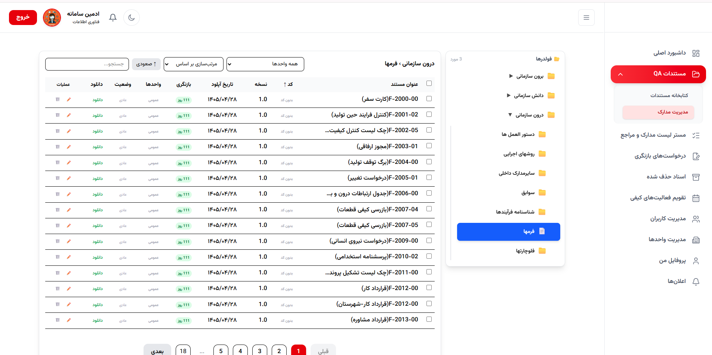
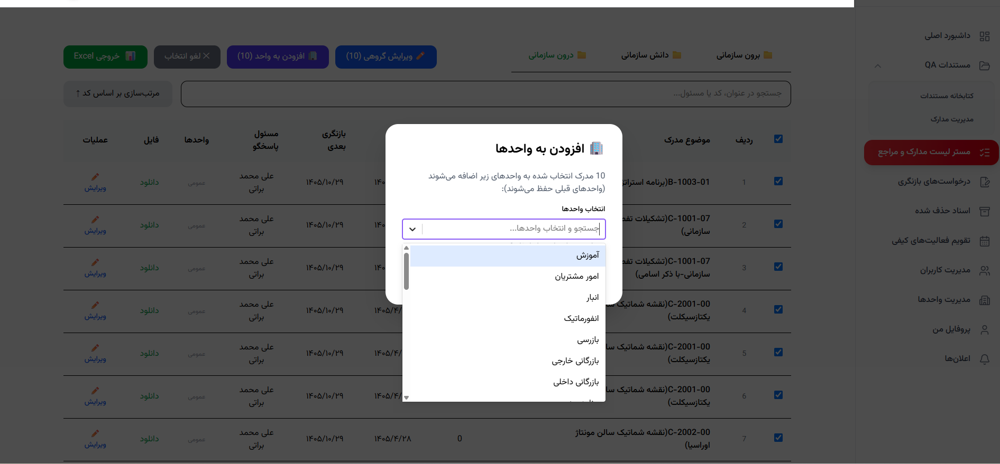
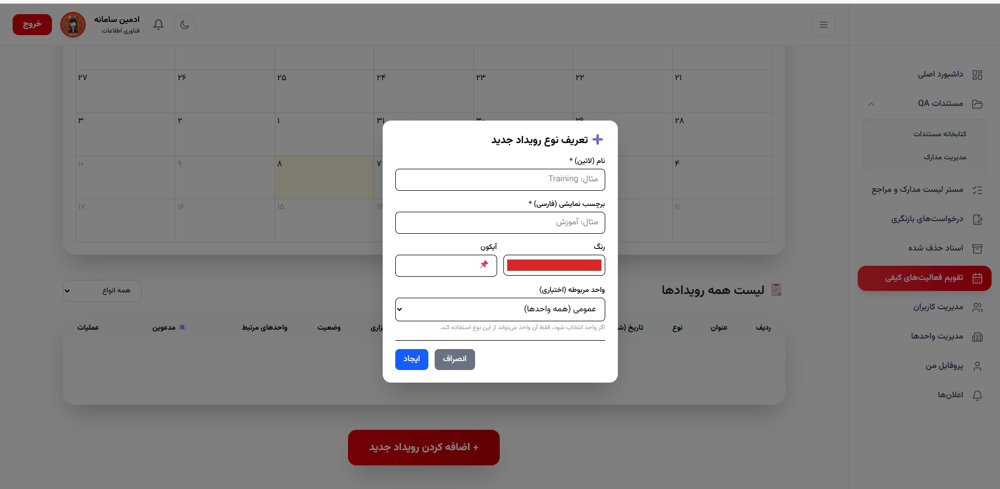
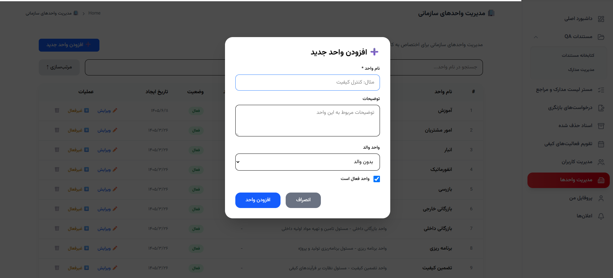
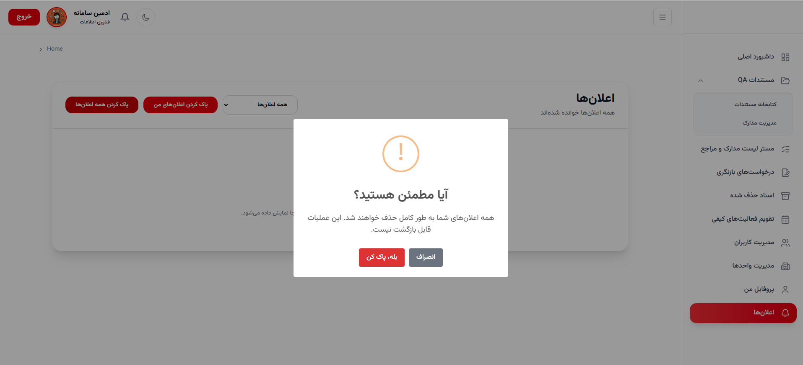
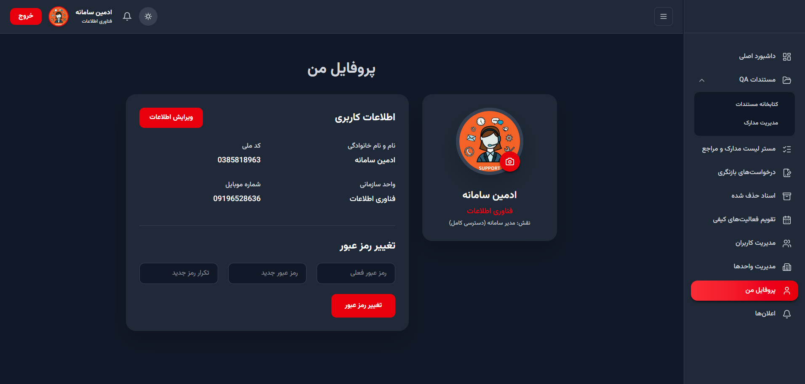

# 📋 Kavir Motor QA System

**Quality Assurance Document Lifecycle Management**

---

## 📌 Overview

Enterprise document management system for the Quality Assurance department at Kavir Motor Co. Manages the entire lifecycle of QA documents — from library and master list, to revisions and quality calendar.

---

## ✨ Key Features

### 📚 Document Library
- Centralized repository for all QA documents
- Version control and revision history
- Master list management
- Advanced search and filtering

### 🔄 Revision Control
- Track document revisions and approvals
- Scheduled review notifications
- Change history with audit trail

### 📅 Quality Calendar
- FullCalendar integration
- Schedule and track quality events
- Deadline reminders and notifications

### 🔔 Notifications System
- Real-time alerts for document updates
- Revision deadlines
- Approval requests

### 🏢 Department & Role Management
- Multi-level access control
- Department, unit, and user-level permissions
- Activity logging

### 👤 User Profile
- Personal information management
- Role and permission overview
- Activity history

---

## 🛠️ Tech Stack

**Frontend:**
- React 19, TypeScript
- Tailwind CSS
- FullCalendar

**Backend:**
- ASP.NET Core 10
- Entity Framework Core
- SQL Server
- JWT authentication
- RESTful API architecture

---

## 📸 Screenshots

### 🔐 Login Page

### 🏠 Homepage / Dashboard

### 📄 Documents Management

### 📋 Master List

### 📅 Quality Calendar

### 🏢 Department Management

### 🔔 Notifications

### 👤 User Profile

---

## 📌 Note

Source code is **private** (proprietary to Kavir Motor Co.).

For questions or demo access, contact: **nc.moghimi86@gmail.com**