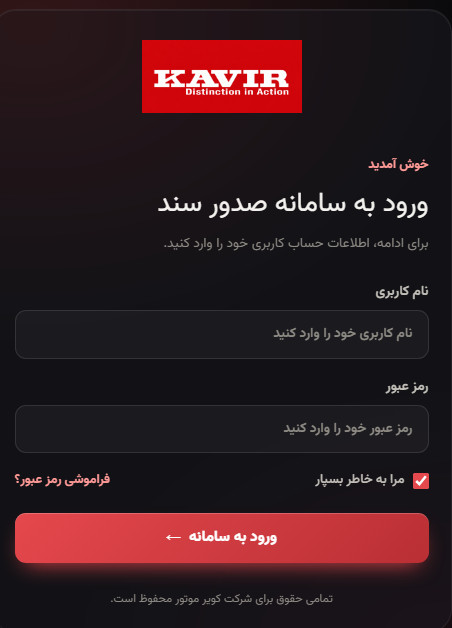
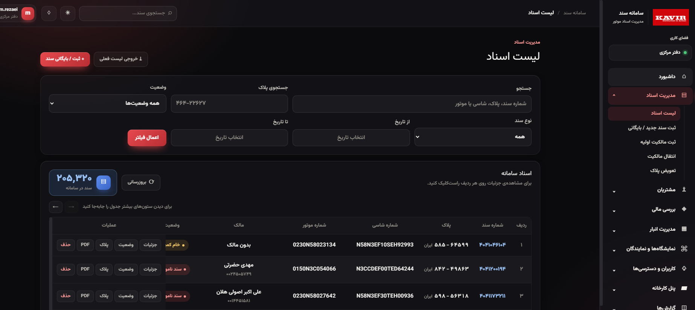
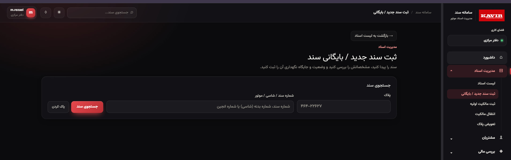

# 🏍️ Motorcycle Ownership Document System

**End-to-End Digitalization of Ownership Documents**

---

## 📌 Overview

A system that fully digitizes the motorcycle ownership document workflow at Kavir Motor Co. — from initial registration to issuance and ownership transfer. Replaces the traditional paper-based process with a secure, traceable, multi-level workflow.

---

## ✨ Key Features

### 📝 Document Registration
- Initial registration with all required data
- Document type classification
- Digital attachment support

### 🔄 Multi-Level Access Control
- Separate access for: **Headquarters**, **Dealerships**, **Factory**
- Role-based data visibility
- Approval workflows per level

### ✍️ Issuance & Transfer
- Document issuance tracking
- Ownership transfer workflow
- Full audit trail for each document

### 📊 Tracking & Reporting
- Real-time status per document
- Search and filter by multiple criteria
- Excel export

---

## 🛠️ Tech Stack

**Backend:**
- ASP.NET Core (.NET 10)
- Entity Framework Core
- SQL Server
- JWT authentication

**Frontend:**
- React
- Tailwind CSS

**Architecture:**
- RESTful APIs
- Multi-level role-based access

---

## 📸 Screenshots

### 🔐 Login Page

### 📋 Document Management

### 📝 Request Form

---

## 🤝 Collaboration

Developed in collaboration with a **senior backend engineer**.

---

## 📌 Note

Source code is **private** (proprietary to Kavir Motor Co.).

For questions or demo access, contact: **nc.moghimi86@gmail.com**